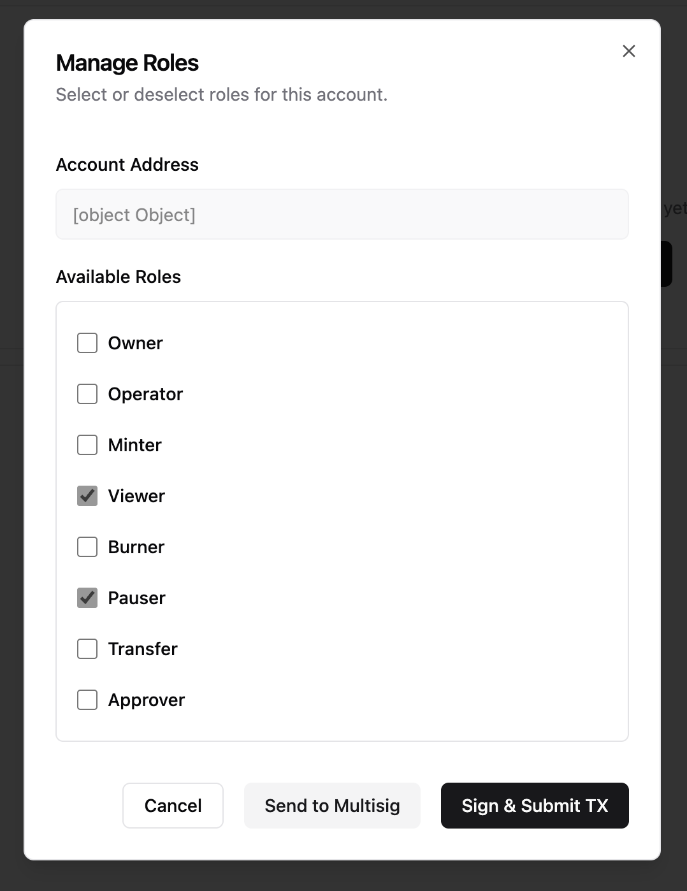
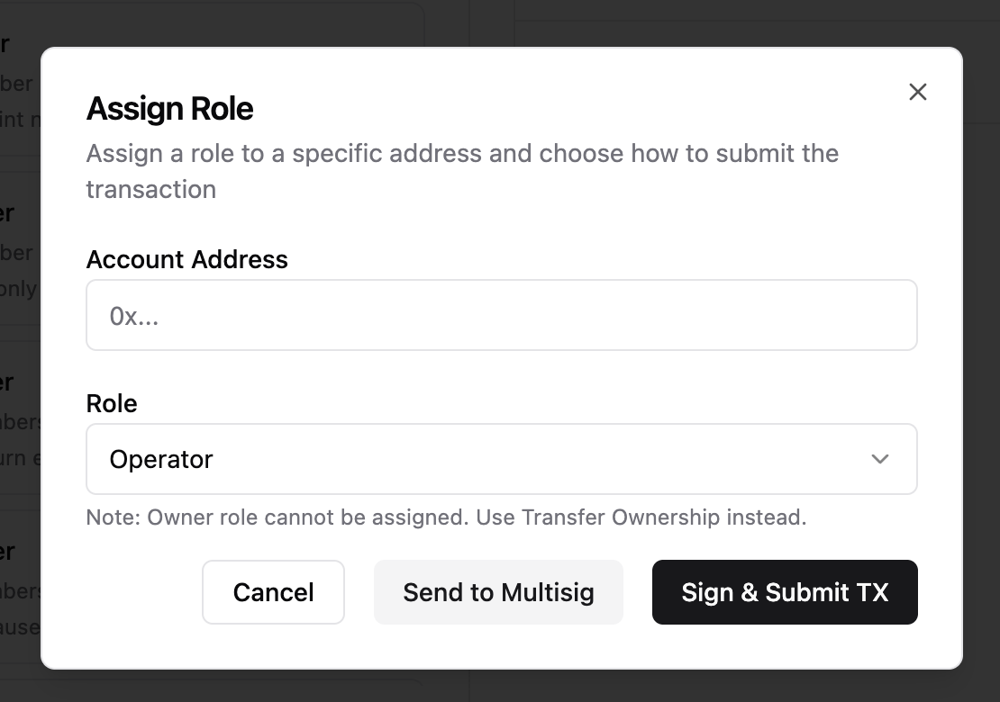
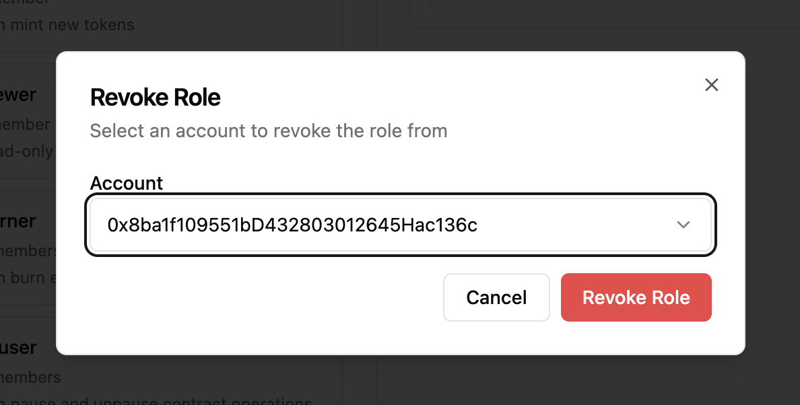

# Feature Specification: Role Grant and Revoke Actions

**Feature Branch**: `014-role-grant-revoke`  
**Created**: 2024-12-11  
**Status**: Draft  
**Scope**: AccessControl role management only (Ownable ownership transfer is OUT OF SCOPE)  
**Input**: User description: "Role grant and revoke action implementation. Business logic (interaction with the access control service via adapter). Re-use existing hooks and packages where possible. UI: Manage Roles dialog with address and role checkbox list."

## Clarifications

### Session 2024-12-11

- Q: How should the system enforce the single-change constraint when a user attempts to toggle a second role? → A: Revert previous change - when user toggles a second checkbox, the first toggle reverts to its original state automatically.
- Q: What should happen after a transaction is confirmed and success state is shown? → A: Show success message briefly (1-2 seconds), then auto-close the dialog.
- Q: Where should the dialogs be accessible from? → A: Three separate dialogs: (1) Manage Roles from Authorized Accounts page, (2) Assign Role from Roles page "+ Assign" button, (3) Revoke Role from Roles page per-account "Revoke" button.
- Q: In the Assign Role dialog, can users change the pre-selected role? → A: Yes, editable dropdown - role is pre-selected but user can change it to any available role.
- Q: Should the "Send to Multisig" button be included in this iteration? → A: No, hidden - don't show the button at all in this iteration; EOA-only for now.
- Q: Does this spec cover Ownable ownership transfer? → A: No, this spec covers AccessControl role management only. Ownership transfer is a two-step process requiring different business logic and UI; it will be a separate feature.
- Q: Clarify "preserve inputs" on cancel vs "auto-revert" behavior? → A: Different contexts: (1) "Preserve inputs" (FR-027) applies when returning from error/cancelled state to form - user's selections remain so they can retry. (2) "Auto-revert" (FR-008) applies during form editing when user toggles a second checkbox - only the most recent change is kept.
- Q: When is the "original state" snapshot taken for Manage Roles dialog? → A: Snapshot is taken when the dialog first opens, before any user interaction. This snapshot is used as the reference for detecting changes and for auto-revert logic.

## UI Standards

### Dialog Titles

- **Manage Roles Dialog**: "Manage Roles"
- **Assign Role Dialog**: "Assign Role"
- **Revoke Role Dialog**: "Revoke Role"

### Button Labels

- **Submit (Grant)**: "Grant {RoleName}" (e.g., "Grant Viewer", "Grant Pauser")
- **Submit (Revoke)**: "Revoke {RoleName}" (e.g., "Revoke Admin")
- **Cancel**: "Cancel"
- **Retry**: "Retry"

### Destructive Button Styling

The "Revoke Role" button uses the existing `variant="destructive"` from the design system, which renders as red background with white text.

### Self-Revoke Warning

A prominent inline alert with:

- **Style**: Warning variant (amber/yellow background)
- **Icon**: Warning/exclamation icon
- **Text**: "You are about to revoke your own {RoleName} role. You may lose access to this action."
- **Position**: Displayed above the action buttons when self-revoke is detected

### Loading States

- **Dialog Opening**: Show skeleton loaders for role list while fetching role data
- **Transaction Pending**: Show spinner with "Waiting for wallet..." text
- **Transaction Confirming**: Show spinner with "Confirming transaction..." text

### Accessibility

- **Focus Management**: When dialog opens, focus moves to first interactive element (Cancel button or first checkbox)
- **Dialog Close**: When dialog closes, focus returns to the trigger element
- **Keyboard Navigation**: Tab through all interactive elements; Escape closes dialog; Enter activates focused button
- **ARIA Labels**: All buttons and checkboxes have descriptive aria-labels

## UI Reference

### Manage Roles Dialog (Authorized Accounts Page)

### Roles Page - Assigned Accounts

### Assign Role Dialog (Roles Page)

### Revoke Role Dialog (Roles Page)

## User Scenarios & Testing _(mandatory)_

### User Story 1 - Manage Roles for an Account (Priority: P1)

As an Administrator, I want to open a "Manage Roles" dialog for an account that shows all available roles with checkboxes reflecting the account's current assignments, so that I can grant or revoke a single role at a time.

**Why this priority**: This is the core interaction pattern for role management. The unified dialog provides a clear view of current state and allows intuitive modification.

**Independent Test**: Can be fully tested by opening the Manage Roles dialog for an account, verifying checkboxes reflect current assignments, toggling one role, submitting, and verifying the change persists.

**Acceptance Scenarios**:

1. **Given** I am viewing the Authorized Accounts page, **When** I click "Manage Roles" for an account, **Then** a dialog opens showing the account address and a list of all available roles with checkboxes.
2. **Given** the Manage Roles dialog is open, **When** I view the role checkboxes, **Then** roles the account already has are checked, and roles it doesn't have are unchecked.
3. **Given** the dialog is open with current assignments shown, **When** I check an unchecked role, **Then** this indicates I want to grant that role to the account.
4. **Given** the dialog is open with current assignments shown, **When** I uncheck a checked role, **Then** this indicates I want to revoke that role from the account.
5. **Given** I have made exactly one role change (one grant OR one revoke), **When** I click "Sign & Submit TX", **Then** the system triggers a wallet signature request for the corresponding transaction.
6. **Given** the transaction is confirmed, **When** the dialog updates, **Then** I see a success state briefly (1-2 seconds), then the dialog auto-closes and the roles data refreshes to reflect the change.

---

### User Story 2 - Single Role Change Constraint (Priority: P1)

As an Administrator, I understand that I can only grant or revoke one role at a time due to the lack of batching capabilities on the blockchain.

**Why this priority**: Critical constraint that affects UX. Users must understand they cannot make multiple changes in a single transaction.

**Independent Test**: Can be tested by attempting to change multiple roles and verifying only one change is allowed before submission.

**Acceptance Scenarios**:

1. **Given** I have already toggled one role checkbox, **When** I attempt to toggle a second role, **Then** the system automatically reverts my first change so only the most recent toggle is active.
2. **Given** I have made one role change, **When** I view the submit button, **Then** it is enabled and clearly indicates the action (e.g., "Grant Viewer" or "Revoke Pauser").
3. **Given** I have made no role changes, **When** I view the submit button, **Then** it is disabled.

---

### User Story 3 - Self-Revoke Warning (Priority: P1)

As an Administrator, if I attempt to revoke my own role, I want to see a clear warning before proceeding so that I don't accidentally lose my permissions.

**Why this priority**: Preventing accidental self-lockout is critical for user experience and security.

**Independent Test**: Can be tested by connecting a wallet, viewing an account that is the connected wallet, unchecking one of its roles, and verifying a warning appears.

**Acceptance Scenarios**:

1. **Given** the Manage Roles dialog is open for my own account (connected wallet), **When** I uncheck a role, **Then** a prominent warning appears indicating I am about to revoke my own permissions.
2. **Given** a self-revoke warning is displayed, **When** I proceed with the revoke, **Then** the system executes the transaction after my explicit confirmation.

---

### User Story 4 - Handle Transaction Rejection (Priority: P2)

As an Administrator, if I reject the wallet signature request, I want the UI to return to its previous state without data loss so that I can retry if desired.

**Why this priority**: Users may accidentally cancel transactions or need to review details before signing.

**Independent Test**: Can be tested by starting a role change, rejecting the wallet signature, and verifying the dialog returns to the form state with checkbox selections preserved.

**Acceptance Scenarios**:

1. **Given** a wallet signature request is pending, **When** I reject/cancel in my wallet, **Then** the dialog shows a "Transaction cancelled" message and returns to the form state.
2. **Given** I cancelled a transaction, **When** I view the form, **Then** my role selection changes are preserved.

---

### User Story 5 - Assign Role from Roles Page (Priority: P1)

As an Administrator viewing a specific role on the Roles page, I want to click "+ Assign" to open a dialog where I can enter an address and grant that role to the address.

**Why this priority**: Direct role assignment from the Roles page is a primary workflow for administrators managing specific roles.

**Independent Test**: Can be tested by selecting a role, clicking "+ Assign", entering an address, submitting, and verifying the address appears in the role's member list.

**Acceptance Scenarios**:

1. **Given** I am viewing a role's details on the Roles page, **When** I click "+ Assign", **Then** an "Assign Role" dialog opens with an address input field and the role pre-selected in a dropdown.
2. **Given** the Assign Role dialog is open, **When** I enter a valid address, **Then** the "Sign & Submit TX" button becomes enabled.
3. **Given** I have entered a valid address, **When** I click "Sign & Submit TX", **Then** the system triggers a wallet signature request for the grantRole transaction.
4. **Given** the transaction is confirmed, **When** the dialog updates, **Then** I see a success state briefly, the dialog closes, and the assigned accounts list refreshes.

---

### User Story 6 - Revoke Role from Roles Page (Priority: P1)

As an Administrator viewing a role's assigned accounts, I want to click "Revoke" on a specific account to remove that role from the account.

**Why this priority**: Quick revocation from the role context is essential for efficient access management.

**Independent Test**: Can be tested by clicking "Revoke" on an assigned account, confirming, and verifying the account is removed from the role's member list.

**Acceptance Scenarios**:

1. **Given** I am viewing a role's assigned accounts on the Roles page, **When** I click "Revoke" for an account, **Then** a "Revoke Role" dialog opens with the account pre-selected and a confirmation prompt.
2. **Given** the Revoke Role dialog is open, **When** I click "Revoke Role", **Then** the system triggers a wallet signature request for the revokeRole transaction.
3. **Given** I am about to revoke my own role, **When** the dialog opens, **Then** I see a prominent self-revoke warning.
4. **Given** the transaction is confirmed, **When** the dialog updates, **Then** I see a success state briefly, the dialog closes, and the assigned accounts list refreshes without that account.

---

### User Story 7 - Handle Network Errors (Priority: P2)

As an Administrator, if a network error occurs during any role transaction, I want to see a clear error message and be able to retry.

**Why this priority**: Network issues are common; the system must provide clear feedback and recovery options across all dialogs.

**Independent Test**: Can be tested by simulating a network disconnect during transaction submission and verifying error handling.

**Acceptance Scenarios**:

1. **Given** a network error occurs during transaction submission (in any dialog), **When** the error is detected, **Then** the dialog shows a "Network error" message with a retry option.
2. **Given** I am viewing a network error state, **When** I click "Retry", **Then** the system attempts to resubmit the transaction.

---

### Edge Cases

#### Manage Roles Dialog

- **No Changes Made**: Submit button remains disabled if no role changes have been made.
- **Multiple Changes Attempted**: When user toggles a second checkbox, the first toggle automatically reverts to its original state (only one change active at a time).
- **Account Has No Roles**: All checkboxes appear unchecked; user can grant any role.
- **Account Has All Roles**: All checkboxes appear checked; user can revoke any role.

#### Assign Role Dialog

- **Invalid Address Format**: Validate address format before enabling submit; show inline validation error.
- **Address Already Has Role**: If the entered address already has the selected role, show validation message (adapter handles on-chain, UI provides feedback).

#### Revoke Role Dialog

- **Self-Revoke Warning**: When a user attempts to revoke their own role, display a prominent warning about losing permissions.

#### All Dialogs

- **Owner Role Exclusion**: The Owner role (from Ownable interface) MUST NOT appear in any role lists. Ownership management is OUT OF SCOPE for this feature (two-step transfer process requires separate UI).
- **Concurrent Modifications**: If the role membership changes while the dialog is open (e.g., another admin modifies), the post-transaction refresh will show the current state.
- **Network Errors**: All dialogs must handle network errors with clear messages and retry options.
- **User Rejection**: All dialogs must handle wallet signature rejection gracefully.
- **No Roles Defined**: If the contract has zero AccessControl roles defined (excluding Owner), all dialogs show an empty state message: "No roles defined for this contract."
- **Wallet Not Connected**: All dialogs require a connected wallet. If wallet disconnects while dialog is open, show "Wallet disconnected" error and disable submit button.
- **Close During Transaction**: If user attempts to close dialog while transaction is pending/confirming, show confirmation: "Transaction in progress. Are you sure you want to close?" Closing does NOT cancel the blockchain transaction.
- **Loading State**: While fetching role data on dialog open, show skeleton loaders for dynamic content (role list, account info). Submit button disabled during loading.

## Requirements _(mandatory)_

### Functional Requirements

#### Dialog 1: Manage Roles (Authorized Accounts Page)

- **FR-001**: System MUST provide a "Manage Roles" dialog accessible from account row actions in the Authorized Accounts page.
- **FR-002**: The Manage Roles dialog MUST display the account address (read-only) at the top of the dialog.
- **FR-003**: The Manage Roles dialog MUST display a list of all available roles with checkboxes.
- **FR-004**: The Owner role MUST be excluded from the checkbox list. Ownership transfer is OUT OF SCOPE (requires separate two-step UI).
- **FR-005**: Checkboxes MUST reflect the account's current role assignments when the dialog opens.
- **FR-006**: Checked checkboxes indicate roles the account currently has; unchecked indicate roles it doesn't have.
- **FR-007**: System MUST enforce that only ONE role change (one grant OR one revoke) can be made per transaction.
- **FR-008**: When a user toggles a second role checkbox, the system MUST automatically revert the first toggle to its original state.
- **FR-009**: The submit button MUST be disabled when no changes have been made.
- **FR-010**: The submit button label SHOULD indicate the pending action (e.g., "Grant Viewer" or "Revoke Pauser").

#### Dialog 2: Assign Role (Roles Page)

- **FR-011**: System MUST provide an "Assign Role" dialog accessible from the "+ Assign" button on the Roles page.
- **FR-012**: The Assign Role dialog MUST display an address input field for entering the target account.
- **FR-013**: The Assign Role dialog MUST display an editable role dropdown, pre-selected with the currently viewed role but allowing the user to select any available role.
- **FR-014**: The role dropdown MUST exclude the Owner role with a note: "Owner role cannot be assigned. Use Transfer Ownership instead."
- **FR-015**: The "Sign & Submit TX" button MUST be disabled until a valid address is entered.
- **FR-016**: Address input MUST use the existing `AddressField` component from `@openzeppelin/ui-builder-ui`, which validates via `adapter.isValidAddress()` for chain-agnostic validation.

#### Dialog 3: Revoke Role (Roles Page)

- **FR-017**: System MUST provide a "Revoke Role" dialog accessible from the "Revoke" button on each assigned account row.
- **FR-018**: The Revoke Role dialog MUST display the account address as read-only text (not editable; pre-filled from the clicked row).
- **FR-019**: The Revoke Role dialog MUST display the role name as read-only text (not editable; pre-filled from the current role context).
- **FR-020**: The "Revoke Role" button MUST use the `variant="destructive"` style (red background, white text).

#### Transaction Execution (All Dialogs)

- **FR-021**: System MUST use the existing `useGrantRole` hook from `useAccessControlMutations.ts` to execute grant transactions.
- **FR-022**: System MUST use the existing `useRevokeRole` hook from `useAccessControlMutations.ts` to execute revoke transactions.
- **FR-023**: All dialogs MUST display transaction status updates (idle, pending, confirming, success, error) during mutations.
- **FR-024**: After a successful transaction, all dialogs MUST show a success state for 1-2 seconds, then auto-close.
- **FR-025**: System MUST invalidate and refetch role data after successful operations (already handled by hooks).

#### Safety & Error Handling (All Dialogs)

- **FR-026**: System MUST display a self-revoke warning when a user attempts to revoke their own role (applies to Manage Roles and Revoke Role dialogs).
- **FR-027**: System MUST handle user rejection gracefully, returning to form state with preserved inputs.
- **FR-028**: System MUST handle network errors with clear messages and retry options.
- **FR-029**: System MUST use the existing `ExecutionConfig` with `method: 'eoa'` for direct wallet transactions.

#### Dialog Actions (All Dialogs)

- **FR-030**: All dialogs MUST have a "Cancel" button to close without changes.
- **FR-031**: Manage Roles and Assign Role dialogs MUST have a "Sign & Submit TX" button for EOA transactions.
- **FR-032**: Revoke Role dialog MUST have a "Revoke Role" button (destructive style) for EOA transactions.
- **FR-033**: "Send to Multisig" button is OUT OF SCOPE for this iteration; dialogs show EOA execution only.

#### Loading & Initialization (All Dialogs)

- **FR-034**: All dialogs MUST show skeleton loaders while fetching role data on open.
- **FR-035**: Submit buttons MUST be disabled during the loading state.
- **FR-036**: If role data fetch fails, display an error state with retry option.
- **FR-037**: If the contract has zero AccessControl roles defined (excluding Owner), dialogs MUST show an empty state: "No roles defined for this contract."

#### Wallet Connection (All Dialogs)

- **FR-038**: All dialogs MUST require a connected wallet to submit transactions.
- **FR-039**: If wallet disconnects while dialog is open, MUST show "Wallet disconnected" error and disable submit button.
- **FR-040**: User can close and reopen dialog after reconnecting wallet.

#### Close Behavior (All Dialogs)

- **FR-041**: If user attempts to close dialog during pending/confirming state, MUST show confirmation prompt: "Transaction in progress. Are you sure you want to close?"
- **FR-042**: Closing dialog during transaction does NOT cancel the blockchain transaction (transaction continues in background).
- **FR-043**: User can close dialog freely during form, success, error, or cancelled states.

#### Accessibility (All Dialogs)

- **FR-044**: When dialog opens, focus MUST move to the first interactive element.
- **FR-045**: When dialog closes, focus MUST return to the trigger element.
- **FR-046**: Escape key MUST close the dialog (unless transaction is pending/confirming).
- **FR-047**: All interactive elements MUST be keyboard accessible via Tab navigation.
- **FR-048**: All buttons and checkboxes MUST have descriptive aria-labels.

#### Performance (All Dialogs)

- **FR-049**: Dialogs MUST open and render initial UI within 100ms (excluding data fetch).
- **FR-050**: Transaction status updates MUST be displayed in real-time (within 500ms of status change).

### Key Entities

- **ManageRolesDialogState**: Dialog state for Manage Roles (account address, available roles, current assignments, pending change).
- **AssignRoleDialogState**: Dialog state for Assign Role (address input, selected role, validation state).
- **RevokeRoleDialogState**: Dialog state for Revoke Role (account address, role to revoke, confirmation state).
- **RoleCheckboxItem**: Individual role data for checkbox list (roleId, roleName, isAssigned, isPendingChange).
- **PendingRoleChange**: The single pending change (type: 'grant' | 'revoke', roleId, roleName, accountAddress).
- **DialogTransactionStep**: Enum representing dialog transaction states:
  - `form` - Initial state, user can make changes
  - `pending` - Transaction submitted to wallet, waiting for user to sign
  - `confirming` - User signed, transaction submitted to blockchain, waiting for confirmation
  - `success` - Transaction confirmed on-chain
  - `error` - Transaction failed (reverted, out of gas, etc.)
  - `cancelled` - User rejected wallet signature request

## Success Criteria _(mandatory)_

### Measurable Outcomes

#### Manage Roles Dialog (Authorized Accounts Page)

- **SC-001**: Users can open the Manage Roles dialog and see current role assignments reflected in checkbox states.
- **SC-002**: Users can grant a role by checking an unchecked checkbox and submitting.
- **SC-003**: Users can revoke a role by unchecking a checked checkbox and submitting.
- **SC-004**: The UI enforces single-change constraint via automatic revert of previous toggle.

#### Assign Role Dialog (Roles Page)

- **SC-005**: Users can open the Assign Role dialog from "+ Assign" with the role pre-selected.
- **SC-006**: Users can grant a role to a new address by entering the address and submitting.

#### Revoke Role Dialog (Roles Page)

- **SC-007**: Users can open the Revoke Role dialog from the "Revoke" button with account pre-selected.
- **SC-008**: Users can revoke a role from an account by confirming and submitting.

#### Cross-Cutting

- **SC-009**: 100% of grant/revoke operations use the existing `useGrantRole` and `useRevokeRole` hooks.
- **SC-010**: Transaction cancellation returns the user to a usable form state with preserved inputs.
- **SC-011**: Self-revoke operations show a clear warning before execution (Manage Roles and Revoke Role).
- **SC-012**: All dialogs auto-close within 1-2 seconds after showing success state.
- **SC-013**: UI updates within 5 seconds of transaction confirmation to reflect the new role state.
- **SC-014**: All dialogs show skeleton loaders during initial data fetch.
- **SC-015**: Dialogs handle wallet disconnection with clear error messaging.
- **SC-016**: All dialogs pass accessibility audit (keyboard navigation, focus management, ARIA labels).
- **SC-017**: Dialogs open within 100ms (excluding network fetch time).
